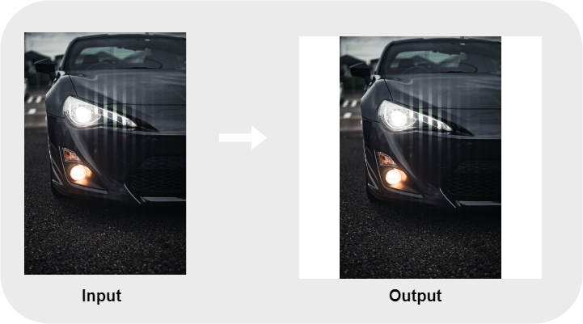

# PhotoSquaringApp

## Overview
This squares a picture by inserting a margin.  

Personally, mainly for Instagram, because Instagram only supports 4:3 aspect ratio for vertical image.  

## Requirement

**Code**  
- Install
Python
  - pip
    - jupyter lab(or jupyter notebook)
    - opencv-python
    - os
    - sys
    - glob
    - numpy
    - matplotlib
    
**App**  
It's not required installing python and its libraries.

## Usage
**Code**  
1. Clone or download _Src_ folder.
2. The directory structure should be as follows:
<pre>
.
├── main.ipynb
├── output
└── img
    └── [imges] # target image
</pre>

3. Run _main.ipynb_
then, processed images are placed in _output_ directory.

If you check the process in matplotlib's window, try _.Test()_ method.

**App**  
1. Clone or download _App_ folder.  
2. Place images in _img_ directory.
3. Run _App_white.exe_ or _App_black.exe_.  
then, processed images are place in _output_ directory.  
※ _App_white.exe_/_App_black.exe_. inserts a white/black margin.  
